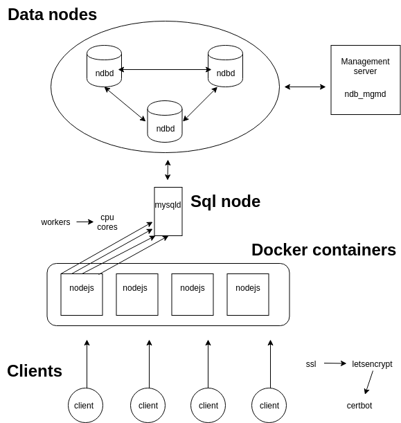

# sensedash

** Under development, not ready for production **



## Get started

### Database

Before you can start you need to setup a database. MySQL NDB database setup documentation is provided as an example:
* [MySQL setup](doc/mysql-db.md)

### Installation

Install Docker:
```console
sudo apt install docker.io
```

Clone repository and change directory
```console
git clone git@github.com:awareframework/sensedash.git
cd sensedash
```


Create config file
```console
nano config/config.json
```

Example (replace with correct variables):
```
{
  "study_id": "id",
  "api_key": "apikey",
  "mysql_ip": "host_ip",
  "mysql_port": "host_port",
  "mysql_user": "mysql_username",
  "mysql_pass": "mysql_password",
  "mysql_database": "mysql_dbname",
  "config": {
    "study_id": "xxx"
  }
}
```

Build dockerimage:
```console
docker build -t nodejs-server .
```

### Running

Run and opening port 3000 from container:
```console
docker run -it --rm -p 3000:3000 --name server nodejs-server
```

### Installation using docker-compose

You can also use docker-compose to run.
In this setting node environment is set to production as default: NODE_ENV=production

```console
docker-compose up
```

### Run with Docker swarm

* [Docker swarm documentation](doc/docker-swarm.md)

### Debug 

```console
DEBUG=app npm start
```

## Requirements

* [Node.js](https://nodejs.org/en/) v6.11.4 +
* [MySQL](https://www.mysql.com/) v5.7 +
* [docker-compose](https://docs.docker.com/compose/) v1.16.1 +
* [docker](https://www.docker.com/) v17.09.0 +
* [Ubuntu Server](https://www.ubuntu.com/)  16.04 LTS

## Authors

* **Mikko Yliniemi** - *Initial work* - [mikkoyli](https://github.com/mikkoyli)

## License

This project is licensed under the APACHE 2.0 License - see the [LICENSE](LICENSE) file for details

